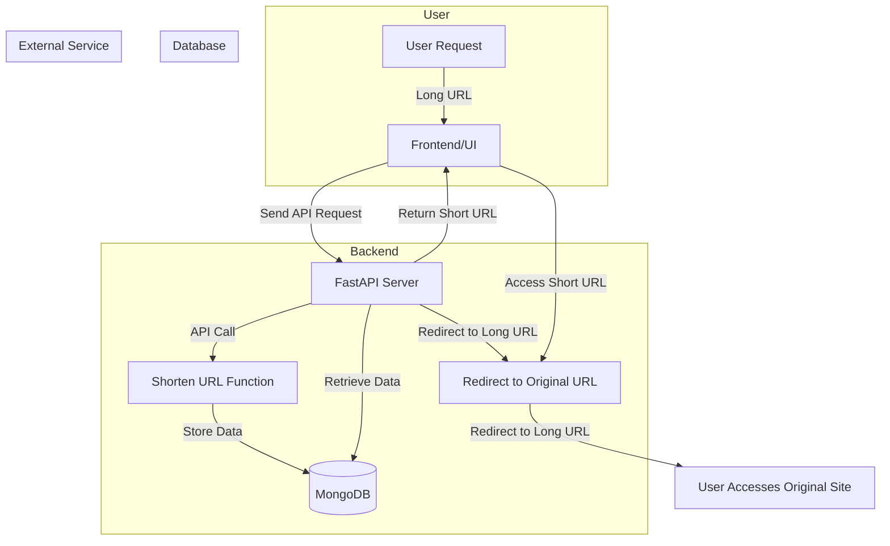

# **🚀 Shorten-URL: A Simple & Efficient URL Shortener**  

## **🔗 Introduction**  
Ever struggled with **long, ugly URLs**? **Shorten-URL** helps you convert them into **short, shareable, and trackable links** in just seconds!  

Whether you're **sharing links on social media, marketing campaigns, or messaging apps**, this tool enhances link **engagement, accessibility, and customization**. While some platforms block unknown short URLs to prevent abuse, **responsible use makes URL shorteners a powerful tool for businesses and individuals alike**.  

## **📂 Project Structure**  
This project is structured as follows:  

```bash
.
├── app
│   ├── api         # API Endpoints
│   ├── common      # Common utilities
│   ├── core        # Core logic and configurations
│   ├── models      # Database models
│   ├── modules     # Main processing modules
│   └── services    # Service layer
├── assets          # Static assets (if any)
├── compose         # Docker-related configurations
└── poc             # Proof of Concept - Example implementations
```


## **🛠️ System Architecture**  

### **🔹 System Overview**  



- **User** submits a **long URL** through the frontend.  
- **FastAPI backend**:
  - Generates a **shortened URL**.
  - Stores mapping in **MongoDB**.
  - Redirects users to the original URL upon request.  
- **MongoDB** acts as the database to store the URL mappings.  


## **📡 API Endpoints**  

| **Method** | **Endpoint**           | **Description**                                                                                                                    |
|-----------|----------------------|----------------------------------------------------------------------------------------------------------------------------------|
| **POST**  | `/api/v1/shorten-data` | Generates a short URL from a given long URL. The client sends a **POST** request with the original URL.                            |
| **GET**   | `/{shorten_url}`       | Redirects users to the original long URL when they access a shortened link. The client sends a **GET** request with the short URL. |
| **GET**   | `/api/v1/info`         | Sends periodic service info for health-checking.                                                                              |

## **⚡ Getting Started**  

You can run the **Shorten-URL** service using either **Python's virtual environment** or **Docker Compose**.

### **🐍 1️⃣ Running with Python's Virtual Environment**  

#### **🔹 Prerequisites**  
- Python **3.8+** installed  
- Virtual environment setup (**Recommended**)  

#### **🔹 Steps**  

```bash
# Clone the repository
git clone https://github.com/learnfrombasic/shorten-url.git
cd shorten-url-service

# Create a virtual environment (Recommended: use `uv`)
python -m venv venv
source venv/bin/activate  # On Windows: venv\Scripts\activate

# Install dependencies
pip install -r requirements.txt

# Set environment variables (or create a .env file)
export HOST=0.0.0.0
export PORT=1802
export DATABASE_URL="mongodb://localhost:27017/shorten-url"

# Run the FastAPI application
uvicorn app.main:app --host 0.0.0.0 --port 1802 --reload
```

🔹 Once the service is running, access it at:  
👉 **http://localhost:1802**  

📌 **Note:** Using `uv` is recommended for initializing Python's virtual environment.


### **🐳 2️⃣ Running with `docker-compose`**  

#### **🔹 Prerequisites**  
- **Docker** and **Docker Compose** installed  

#### **🔹 Steps**  

```bash
# Clone the repository
git clone https://github.com/learnfrombasic/shorten-url.git
cd shorten-url-service

# Build and start the service
docker-compose -f docker-compose.yml up -d
```

✅ **What this does:**  
✔️ Builds the **Docker image**  
✔️ Starts the service on **port 1802**  

🔹 Once running, access the service at:  
👉 **http://localhost:1802**  

To stop the service, run:
```bash
docker-compose -f docker-compose.yml down
```
## **👨‍💻 Contributor**  
This project is developed and maintained by:  
- **[Le Duc Minh](https://github.com/MinLee0210)**  

💡 **Have ideas or improvements?** Feel free to contribute or reach out! 🚀  

