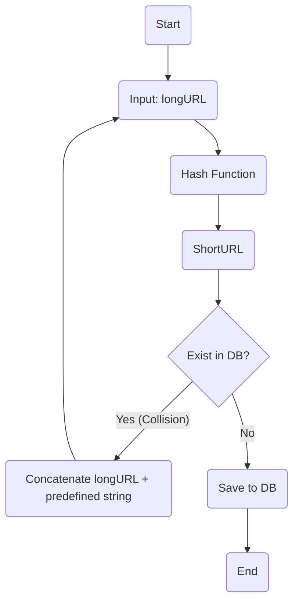

# shorten-url

## Introduction

## Shorten URL

### Hash Map Collision

```mermaid
graph TD;
    A(Start) --> B(Input: longURL)
    B --> C(Hash Function)
    C --> D(ShortURL)
    D --> E{Exist in DB?}
    E -- Yes (Collision) --> F(Concatenate longURL + predefined string) --> B
    E -- No --> G(Save to DB) --> H(End)
```